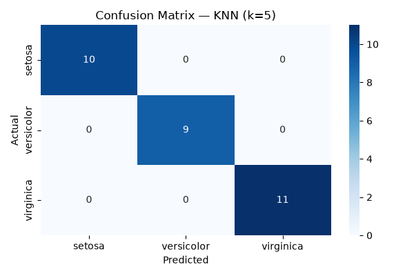
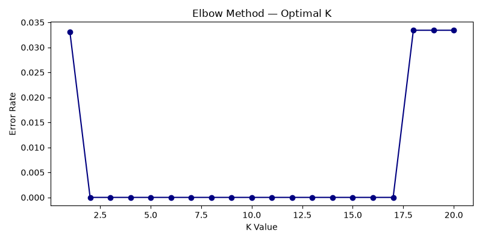

# Project 2 — Data Classification Using AI

## Overview
A supervised learning pipeline that classifies Iris flowers into three species (setosa, versicolor, virginica) using the K-Nearest Neighbors (KNN) algorithm. Covers the full ML workflow: load → scale → split → train → predict → evaluate.

## Features
- Loads the classic Iris dataset (150 samples, 4 features, 3 balanced classes)
- Feature scaling via `StandardScaler` (required for distance-based algorithms like KNN)
- 80/20 train-test split with shuffling to remove order bias
- KNN classifier (k=5)
- Evaluation via Confusion Matrix and F1 Score (weighted)
- Bonus: Elbow method to find the optimal K value

## Tech Stack
- Python 3.12
- scikit-learn, pandas, numpy, matplotlib, seaborn

## How to Run
```bash
pip install numpy pandas matplotlib seaborn scikit-learn
python "Data classification.py"
```

## Results
| Metric | Score |
|--------|-------|
| F1 Score (weighted) | 1.0000 |
| Test samples | 30 |
| Misclassifications | 0 |

### Confusion Matrix


### Elbow Curve (Optimal K)


## Key Learning
Accuracy alone can be misleading on imbalanced datasets. The confusion matrix and F1 score provide a more complete picture of model performance by showing exactly where predictions succeed or fail (true positives vs. false positives/negatives). Feature scaling was essential here since KNN is a distance-based algorithm — unscaled features would bias results toward whichever feature has the largest numeric range.
